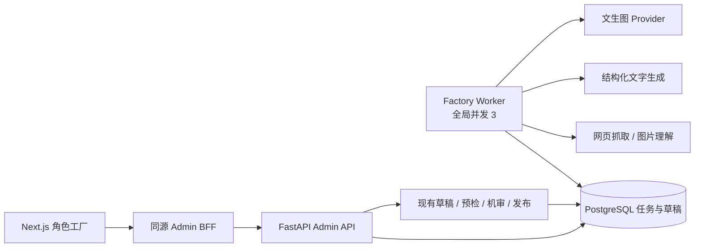
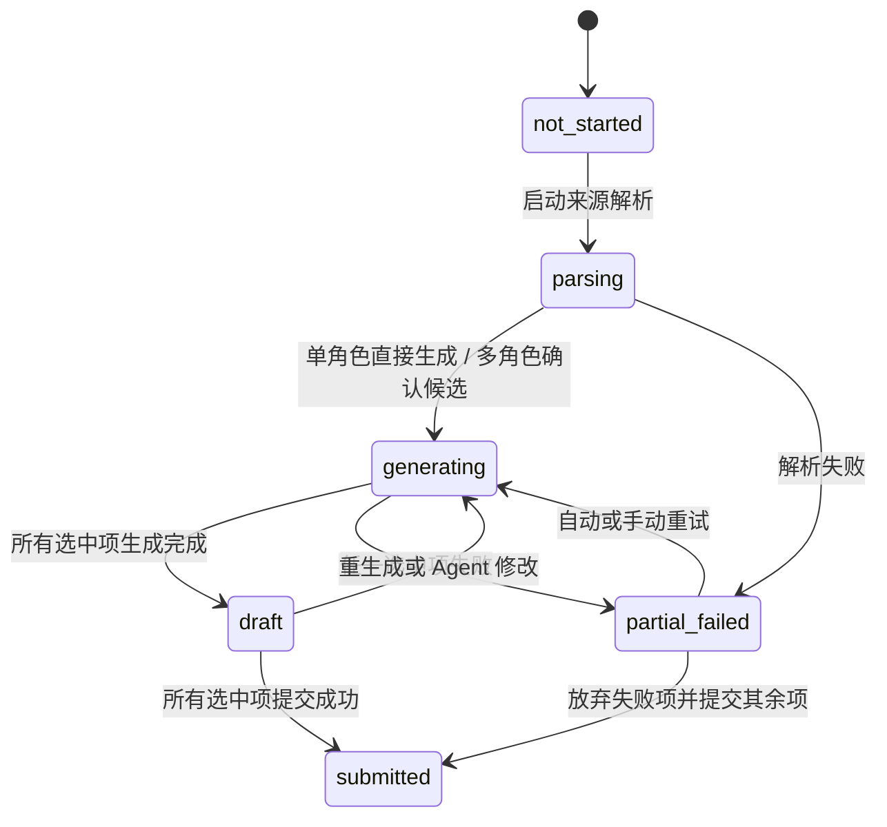

# Plum 角色工厂技术设计

- 状态：开发中，任务底座与管理端主流程已落地
- 范围：单角色生成、多角色生成
- 原型：[单角色](./character-factory/index.html) / [多角色](./character-factory/multi.html)

## 1. 已定规则

- 管理后台新增一级入口「角色工厂」，二级页为「单角色生成 / 多角色生成」。
- 所有后台角色复用 `operations.access`，均可查看、生成、测试和提交。
- 状态：`not_started / parsing / generating / draft / partial_failed / submitted`。
- 内容模式默认 `limited`，生成开始后不可修改。
- 外部生成调用全局并发不超过 3；单次尝试默认超时 60 秒。
- 自动重试 1 次；手动重试不限次数。
- 首期不做草稿箱、自动保存和离开页面后的恢复入口。
- 投稿字段、媒体、预检、机审、发布全部复用当前真实链路。

三个首期默认值：

- 归属：开始任务前选择一个真实 Plum 平台账号；多角色整批共用，不支持候选级改归属。
- 批量规模：默认 8，范围 1–20。后续按成本和成功率调大。
- URL 来源：只保证公开、无需登录的 HTTP(S) 页面；登录墙、强反爬、纯 JS 页面不承诺成功。

> 若目标是官方/system 角色，需要新增 owner 类型和发布链路。当前已上线投稿只支持真实 `platform_user_id`，不放进首期。

## 2. 核心方案



采用「提交任务 + 轮询」，不维持 60 秒同步请求，也不为首期引入 Redis、Celery 或 SSE。

- `POST` 创建或启动任务，立即返回 `202 + run_id`。
- 前端每 1.5 秒查询一次；页面后台化后降到 5 秒；进入终态后停止。
- PostgreSQL 保存任务、租约和尝试次数；Worker 用 `FOR UPDATE SKIP LOCKED` 领取。
- 单角色与多角色共用同一套模型。差别只是一个 Run 下有 1 个还是 N 个 Candidate。

## 3. 三层数据关系

```text
Run（一次创作意图 / 一个批次）
└── Candidate（一个稳定候选方向） × N
    ├── FactoryTask（解析、生图、生文、修改的执行记录） × N
    └── CreationDraft（真实投稿草稿） × 0..1
         └── Character（提交成功后） × 0..1
```

### Run

保存整次任务不应变化的条件：

- `kind`: `single | batch`
- `content_mode`: `limited | limitless`
- `source_type`: 单角色为 `mixed`，批量为 `url_text | text | image_text`
- `source_payload`、创作意图、语言/市场
- `owner_platform_user_id`
- `target_count`
- 创建人、状态、进度计数、提交批次 ID

单角色的 `mixed` 可同时保存候选图片、文字描述与竞品链接，三者至少一项非空；批量任务仍按三类来源单选。

### Candidate

保存候选身份和当前结论：

- Candidate ID 一经生成不改变；删除实际是标记 `rejected`。
- Agent 解析出的描述、参考图、来源依据属于 Candidate。
- 用户选择、合并、补充后，选中的 Candidate 才进入图文生成。
- 首次生成成功后链接一个真实 `plum_creation_drafts.work_id`。
- 重试保留 Candidate ID，只增加 Task attempt，避免工作台 URL 和审计漂移。

### Workbench

工作台只是 Candidate 对应 CreationDraft 的编辑视图，不复制第三份角色数据。

- 手改通过 `expected_revision` 更新真实草稿，冲突返回 `409`。
- Agent 修改先生成预览；用户点击应用后才更新草稿 revision。
- 图片修改和文字修改可以并发，但应用时都做 revision 校验。
- 对话测试固定读取一次 draft revision；草稿变化后提示重新开始测试。

这解决了多角色流程里的几个关键问题：

- 批次、候选和草稿各自只有一个事实源。
- 单个角色失败不阻塞同批其他角色。
- 批量操作改一组 Candidate，工作台只改当前 Candidate。
- 部分提交按 Candidate 独立幂等，不会重复创建已成功角色。
- 批次状态由子项汇总，不维护容易漂移的第二套布尔状态。

## 4. 状态计算



Run 状态按以下优先级派生：

1. 有解析任务运行：`parsing`
2. 有图文任务运行：`generating`
3. 有失败子项：`partial_failed`，包括全部失败，界面同时显示成功数
4. 所有本次选中项已提交：`submitted`
5. 其余已有完整草稿：`draft`
6. 尚未启动：`not_started`

部分角色已提交、其余仍是草稿时，Run 保持 `draft`，额外显示 `submitted / total`。

## 5. Limited / Limitless

`content_mode` 是生成策略，不是投稿评级。它由后端冻结并注入图像、文字两个 system policy block，前端不能自行拼接或覆盖。

```text
硬性平台规则（两种模式都生效）
→ 内容模式规则
→ 被标记为“不可信引用”的网页/图片解析结果
→ 运营创作意图
→ 严格输出 Schema
```

| 模式 | 图文提示词 | 投稿评级默认值 |
| --- | --- | --- |
| `limited` | 禁止裸露、显性性行为和色情化描写 | `general` |
| `limitless` | 可以按意图生成合规成人向内容；人物必须明确为成年人 | `mature`，运营可在预检前调整 |

两种模式都继续经过平台硬规则、图文机审和投稿预检。`limitless` 不是绕过审核。

Prompt、模型和策略都保存版本号：`prompt_version / policy_version / provider / model`。日志与操作审计只记这些标识、状态和错误码，不记完整来源、Prompt 或测试对话正文。

## 6. 任务执行

FactoryTask 类型：

```text
source_parse       URL 抓取与解析
image_understand   示例图理解
candidate_plan     生成候选池
text_generate      生成真实投稿文字字段
image_generate     生成角色原图
assemble_draft     建立/更新 CreationDraft
revise_text        按描述修改文字
revise_image       按描述修改图片
```

并发限制约束“外部调用”，不是角色数：一次 LLM 或生图请求各占一个槽，所有 Run 合计最多 3 个。数据库领取任务时在同一事务内检查有效租约数，避免多 Worker 各跑 3 个。

单次尝试默认 60 秒。自动重试只覆盖：

- 连接失败、超时、`429`、`5xx`
- Provider 返回空结果
- 结构化文字无法通过 Schema 校验

参数错误、内容政策拒绝、投稿字段校验失败不自动重试。首次失败后最多自动再试一次；手动重试开启新 cycle，累计次数但不设上限。

Worker 保存 provider request ID 和调用幂等键。OpenAI 成功后的本地持久化失败直接终止，避免自动再次购买图片；请求超时仍按全局规则最多自动重试一次。

## 7. 生成结果

文字 Provider 必须返回结构化对象，字段直接对齐投稿：

```text
display_name
gender: male | female | non_binary
intro
opening_scene
character_settings
example_dialogues
response_rules
tag_suggestions
rating_suggestion: general | mature
```

后端执行 Pydantic/JSON Schema 校验，再创建真实 CreationDraft。标签建议必须映射到平台 active tag ID，不能把模型自由文本直接投稿。

图片分两条路径：

- 手动上传/替换：复用现有「预签名 → 浏览器直传 → complete → image-set」。
- Provider 生图/改图：后端保存结果到现有 owner-scoped media，再创建 image-set，生成 9:16 立绘和 1:1 头像。
- 图片理解只读取 Run owner 的 `source_media_ids`；图片修改只读取任务冻结草稿中的当前立绘。两者可发送给 OpenAI，不开放任意 media ID 读取。

最终草稿只保存 `portrait_media_id / image_set_id / portrait_crop / avatar_crop`，不能拿外部图片 URL 直接投稿。

## 8. API

统一前缀：后端 `/admin/plum/character-factory`，浏览器经 `/api/admin/character-factory` 访问。

| 方法 | 路径 | 用途 |
| --- | --- | --- |
| `POST` | `/runs` | 创建 Run，返回 `run_id` |
| `POST` | `/runs/{id}/start` | 启动解析/单角色生成 |
| `GET` | `/runs/{id}` | 聚合状态、候选、进度；供轮询 |
| `PATCH` | `/runs/{id}/candidates/{cid}` | 选择、拒绝、编辑候选方向 |
| `POST` | `/runs/{id}/generate` | 生成选中的候选 |
| `GET` | `/candidates/{cid}/draft` | 读取真实草稿和 revision |
| `PATCH` | `/candidates/{cid}/draft` | 手改草稿，要求 `expected_revision` |
| `POST` | `/candidates/{cid}/agent-revisions` | 创建图/文修改任务，先产出预览 |
| `GET` | `/candidates/{cid}/agent-revisions/{task_id}/preview-image/{side}` | 读取改图前/后预览 |
| `POST` | `/candidates/{cid}/agent-revisions/{task_id}/apply` | 应用 Agent 修改结果 |
| `GET` | `/candidates/{cid}/draft/portrait` | 读取当前草稿立绘 |
| `POST` | `/candidates/{cid}/preview-turns` | 基于指定 revision 测试一轮对话；待外部数据授权后开放 |
| `POST` | `/tasks/{task_id}/retry` | 手动重试一个失败环节 |
| `POST` | `/runs/{id}/preflight` | 调用真实投稿预检 |
| `POST` | `/runs/{id}/submit` | 提交选中且通过预检的 Candidate |

所有接口使用 `operations.access`。所有写操作继续受 `ADMIN_API_WRITE_ENABLED` 控制，并增加独立开关 `PLUM_CHARACTER_FACTORY_ENABLED` 便于灰度。

请求使用 `Idempotency-Key`；更新草稿使用 `If-Match` 或 `expected_revision`；错误统一包含 `code / message / request_id / retryable`。

## 9. 投稿映射

提交不新增第二套发布逻辑。Factory API 把 Candidate 的 CreationDraft 交给现有 `submit_creation_draft` / character import application service。

| 工厂值 | 真实投稿值 |
| --- | --- |
| Candidate ID | `row_key` |
| Run ID | 稳定 `batch_id` / 幂等来源 |
| Run owner | `default_owner_platform_user_id` |
| 草稿文字 | 六个真实文案字段 |
| Active tag 映射 | `tag_ids` |
| 内容评级 | `creator_declared_rating` |
| 草稿可见性 | `visibility`，默认 `private` |
| 生成图片集 | media、image-set 与两套 crop |

提交前必须补齐：`reason`、`adult_confirmed=true`、`rights_confirmed=true`。服务端继续执行 token budget、owner、图片规格、标签、评级、机审和发布校验。

单 Candidate 独立返回：`published / pending_review / rejected / failed`，并保存 `character_id / work_id / version_number / review_id`。这些是投稿结果，不与 Factory Run 状态混用。

## 10. 对话测试

Draft Preview Turn 的编译与响应契约已完成，路由待外部数据授权后开放。它不创建正式 Connection，不写用户记忆、关系进度或用户 Persona，也不产生线上消息。

- 输入：Candidate ID、draft revision、本轮文本、当前页面内的测试历史。
- Prompt：复用真实角色 prompt compiler 和回复模型。
- 默认：固定初始关系、无历史记忆、无用户画像。
- 首期同步返回 JSON，单次上限 60 秒；超时允许用户重试。

因此它验证的是角色口吻和基础设定，不承诺复现长期关系、记忆和用户个性化后的全部线上效果。

## 11. 前端落点

```text
app/(admin)/character-factory/page.tsx              → redirect /single
app/(admin)/character-factory/single/page.tsx
app/(admin)/character-factory/multi/page.tsx
app/(admin)/character-factory/multi/[runId]/[candidateId]/page.tsx
features/character-factory/
  factory-tabs.tsx
  single-console.tsx
  multi-console.tsx
  candidate-workbench.tsx
  reducer.ts
  contracts.ts
  api.ts
```

- 一级导航注册在 `features/admin-navigation/modules.ts`，href 为 `/character-factory`。
- 二级导航使用显式路由，不用 query 承载两条完整工作流。
- Client Component 使用 reducer 管理页面状态，不引入新的全局状态库。
- Run ID / Candidate ID 放进 URL；首期不提供历史列表和“恢复上次任务”入口。
- 生成结果与显式保存的修改必须服务端持久化，否则异步任务和工作台无法共享；“不做恢复”只指没有自动保存输入和恢复入口。
- BFF allowlist 显式加入 Factory 路径；OpenAPI 先改后端权威文件，再同步本仓库契约。

## 12. 后端落点

新增三张表：

```text
plum_character_factory_runs
plum_character_factory_candidates
plum_character_factory_tasks
```

Candidate 不重复保存完整投稿正文，只保存 `work_id`。Agent 修改预览可以暂存在对应 Task 的 `output_json`，应用后写入 CreationDraft。

优先复用：

- LLM：`agent_runtime.llm.generate_completion`，新增 Factory task tier 和严格结构化 adapter。
- URL：现有安全 web fetch/search；保持 SSRF、跳转、大小和超时限制。
- 示例图：OpenAI Responses API 多图理解，使用严格输出 Schema 和 owner 隔离。
- Worker：复用现有 image job 的 PostgreSQL lease / claim 模式。
- 草稿与提交：`creation_drafts`、prompt budget、moderation、`submit_creation_draft`。

仍需接线：Draft Preview Turn 的外部模型调用。

当前已落地：

- 管理端入口、单/多角色页面、候选工作台和完整 Fixture 验收流。
- Run / Candidate / Task 三表、权限与灰度开关。
- 创建、启动、轮询、候选编辑、批量生成、任务重试 API。
- PostgreSQL 全局 3 槽、60 秒租约、一次自动重试、手动 retry cycle。
- 严格文字输出 Schema、`Limited / Limitless` 服务端策略上下文。
- 后端权威 OpenAPI、前端生成类型与 wire adapter。
- 真实 CreationDraft 读写、revision CAS、投稿预检、机审、发布与逐候选回执。
- Agent 修改任务账本、预览 Schema、重复应用幂等和失败隔离。
- OpenAI 文生图、参考图理解和当前草稿图片修改；请求与响应均有大小上限，错误只保留稳定 code。
- 前端单/多角色工作台、图片手动替换、图文修改差异确认和对话测试界面。

当前远端模式可完成 Run、候选、真实草稿、图文修改和投稿主链路。对话测试的应用服务已具备，外部模型调用仍待单独授权。

不会伪造生产结果：Fixture 仅用于本地验收，远端缺少 Provider 时必须显示明确错误。

## 13. 开发顺序

1. 后端 OpenAPI、迁移、Run/Candidate/Task 状态机与 Worker。
2. 文本生成、文生图、媒体入库和单角色完整链路。
3. 多角色来源解析、候选池、并发生成和部分失败重试。
4. 工作台手改、Agent 修改预览、对话测试。
5. 投稿预检、部分提交、审计、灰度开关。
6. 管理后台一级入口、二级页面和端到端测试。

首批必须覆盖的测试：并发始终 ≤3、60 秒超时、仅自动重试一次、手动重试不封顶、租约接管、结构化输出拒绝、两种内容模式同时进入图文 Prompt、owner 隔离、revision 冲突、部分失败、提交幂等、刷新后任务不丢但不出现恢复入口。

## 14. 开发前唯一可调整项

当前设计按“任务开始前选择一个真实平台归属账号”推进。若产品实际要求角色归属官方/system，先改发布模型，不应拿普通用户账号伪装官方角色。

其余未定参数均已给出首期默认值，不阻塞开发。
