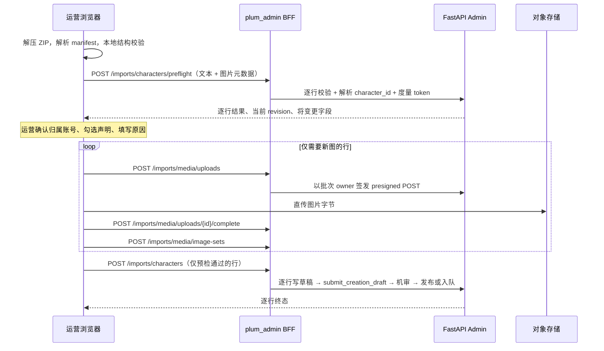

# 角色批量导入技术设计

- 文档版本：v1.2（决策已落定，待评审）
- 更新时间：2026-09-05
- 关联文档：[角色批量导入 PRD](./CHARACTER_IMPORT_PRD.md) · [管理后台技术设计](./TECHNICAL_DESIGN.md)
- 实施范围：一期之外的新增能力

## 1. 设计摘要

批量导入**不新增发布内核**。后端 Plum 创作链路已经完整覆盖草稿、媒体直传、图片渲染、同步机审、人工复核入队、改版与幂等。本方案要做的是三件事：

1. 在 FastAPI 侧加一层**批量编排 API**，把已有的用例串起来，并允许由服务端指定归属账号。
2. 在 `plum_admin` 侧加一个**导入台**：浏览器本地解包、预检、编排上传、展示逐行结果。
3. 允许由服务端指定内容归属账号，并对该账号做有效性校验。

本期**不改动任何领域模型**：不引入官方账号，不改 `owner_kind`，不产出 `source=official`。后端新增的全部是编排层与 Admin 侧入口。

架构约束不变：浏览器不持有后端凭据，`plum_admin` 只走 BFF 调后端 API，不连数据库，不复制业务规则。

### 1.1 与一期边界

一期是纯只读，`ADMIN_API_WRITE_ENABLED` 与 `PLUM_ADMIN_WRITES_ENABLED` 全程为 `false`（开发计划 §2.8）。本能力必须：

- 后端新增路径并显式加入 `docs/products/plum/openapi/admin_v1.json` 导出集合；
- 前端同步契约快照、重新生成类型、通过 `contract:check`；
- 在 `lib/bff/allowlist.ts` 显式放行，不能靠通配；
- 打开两侧写开关；
- 通过独立的契约与安全评审。

**关于契约的顺序问题（复用 `operations.access` 后已解除阻塞）：**

`lib/auth/capabilities.ts:12` 把 `Capability` 定义为 `BackendAdminIdentity["capabilities"][number]`——它是从生成类型里反推的，前端无法自行发明后端不认的能力值。如果本方案新增 `character.import`，那么在后端发布契约之前，前端连往允许清单里加一条规则都过不了 `tsc`。

改为复用 `operations.access` 之后，**允许清单、导航注册、写开关判断全部可以立即落地**，不必等后端。仍需等契约的只剩响应体类型；参照 `features/admin-resources/contracts.ts` 里 `SubscriptionSummary` 的既有做法（fixture 模块手写类型），导入模块可以先手写请求/响应类型，等后端契约落地后替换为生成类型。这条替换必须在联调前完成，不能留到上线后。

**写开关本期直接开启**（`ADMIN_API_WRITE_ENABLED=true`、`PLUM_ADMIN_WRITES_ENABLED=true`）。连带影响：这两个开关是全局的，打开后**内容复核的三处置（`release` / `confine` / `purge`）也随之在生产可用**，其中 `purge` 不可撤销。**2026-09-05 已拍板接受这一连带影响**，不为导入拆独立开关——`lib/bff/config.ts` 保持现状；前提是这些写操作都留得下审计（覆盖范围与两处已知不足见 PRD §11.3）。

## 2. 现状盘点

| 能力 | 现有实现 | 复用方式 |
| --- | --- | --- |
| 内容契约 | `api/contracts.py::CreateCharacterRequest`（`extra="forbid"`） | 打包规范的字段权威，服务端复用同一模型做校验 |
| 草稿 | `plum_creation_drafts`，PK `work_id`，含 `revision`、`published_character_id` | 新建与更新的统一编辑面 |
| 立绘直传 | `POST /creator/media/uploads` 签发 S3 presigned POST → `/complete` 校验字节数、sha256 与真实解码结果 | 新增 Admin 同语义端点，owner 由服务端注入 |
| 图片渲染 | `infrastructure/character_images.py`：立绘 9:16（360/540/900），头像 1:1（96/192/384），avif+webp+jpeg | 复用 `image-sets`，未给裁剪时居中裁 |
| 同步机审 | `application/character_creation.py::submit_creation_draft` | 逐行复用，与用户侧同一条链路 |
| 人工复核 | 机审 `needs_review` 自动入队，后台「内容复核」模块已交付 | 导入产生的待审自然进入现有队列 |
| 改版 | `repository/characters.py::publish_character_revision`，`promote_projection=False` 时旧版本继续在线 | 更新路径直接复用 |
| 幂等 | `plum_character_version_publish_requests` / `creation_publish_requests`，按 `idempotency_key` 去重 | 支撑断点续传与重复提交 |
| Prompt 预算 | `application/character_prompt_budget.py`，`assert_character_prompt_fits` | 预检直接调用，与发布期同一入口 |
| Tag 词表 | `data/plum/tags.json`，当前 77 个 active | 预检与模板的唯一来源 |

## 3. 领域事实：新建与更新

### 3.1 草稿是唯一编辑面

`plum_creation_drafts` 以 `work_id` 为主键，持有 `owner_platform_user_id`、`content_json`、`revision` 与 `published_character_id`。一个角色首次发布后，其草稿行的 `published_character_id` 被写上角色 ID。

`submit_creation_draft` 据此分流（`character_creation.py:639-673`）：

- `published_character_id` 为空 → `publish_created_character`，创建 Work 与 Character；
- `published_character_id` 有值 → `publish_character_revision`，在既有角色上发布新版本。

**导入不需要自己实现两条路径**，只要把内容写进正确的草稿行再提交即可。

### 3.2 由 `character_id` 定位草稿

预检阶段的解析链路：

```text
character_id
  → plum_characters.work_id
  → plum_creation_drafts(work_id)
  → 校验 published_character_id == character_id
  → 校验 owner_platform_user_id == 本行归属账号
  → 取出当前 revision
```

任一步失败即该行报错，不做任何写入。

**已知限制**：没有草稿行的角色无法更新。用户侧发布的角色一定有草稿（发布必经草稿），但通过 bootstrap 或 fixture 种子直接写入的角色没有。本期对这类角色返回 `character_not_editable`，不补建草稿——补建草稿等于凭空构造一份"当前内容"，而版本快照里的内容与草稿内容并不保证同构。

### 3.3 改版的版本可见性

`publish_character_revision(promote_projection=False)` 时只落 Version 行，不动 `plum_characters` 当前投影。这正是"改版待人工复核"的形态：上一个已批准版本继续在线，复核 release 时才提升为当前。

这条语义是既有的，导入不需要额外处理，但**结果页的文案必须准确**：待复核的更新行不能显示成"已生效"。

### 3.4 立绘的沿用

草稿更新时，若内容不带新的 `portrait_media_id`，`_retain_draft_portrait`（`creation_drafts.py:51`）会保持既有立绘的引用。因此更新行留空 `portrait_file` 是安全的，不会导致立绘丢失，也不需要重传图片。

## 4. 需要的后端改动

### 4.1 归属账号

归属账号由导入批次指定（批次默认 + 行级覆盖），编排层把它作为 `platform_user_id` 传给既有用例。浏览器不能绕过 BFF 直接指定，值随请求体提交后由后端重新校验。

**批次默认归属账号是必填的**，请求体里缺失或为空即整批 400（`owner_required`），不允许落到任何隐式默认值上。行级 `owner_platform_user_id` 缺失时取批次默认值，因此每一行的 owner 在编排层入口处就已确定，下游不存在 `None`。

**账号选择器不需要新增端点。** 已有的 `GET /admin/plum/users?q=`（`app/products/plum/api/admin/users.py:85`）支持模糊搜索、只要 `operations.access`，且已经在 `lib/bff/allowlist.ts` 的放行规则里（`/^users(?:\/[^/]+)?$/`）。前端直接复用它做搜索选择，从源头消除手敲 ID 的错误，服务端仍然按 §4.2 重新校验一遍。

**本期不做的**：`publish_created_character` 在 INSERT `plum_works` 时把 `owner_kind` 写死为 `'platform_user'`（`repository/characters.py:571`），而后台按 `owner_kind == 'system'` 判定 `source=official`（`api/admin/content.py:80`）。本期保持这个写死值不动，因此导入产物一律是 `source=ugc`。

将来若要产出官方角色，改动面很小——给 `publish_created_character` 加一个 `owner_kind: str = "platform_user"` 参数并由编排层决定取值即可（技术设计 §7.3 预留的 `PLUM_OFFICIAL_CREATOR_PLATFORM_USER_ID` 配置同时落地）。记录在此以便后续直接取用，本期不实现。

媒体、草稿、图片集都挂在 `owner_platform_user_id` 下，**媒体隔离模型完全不动**。

### 4.2 归属账号校验

导入前对目标 owner 校验：

| 校验 | 数据源 | 失败错误码 |
| --- | --- | --- |
| 账号存在 | `platform_users` | `owner_not_found` |
| 持有 Plum Membership 且 active | `product_memberships` where `app_id='plum'` | `owner_membership_inactive` |
| 创作资格未受限 | `plum_creator_controls` | `creator_restricted` |

`plum_creator_controls` 目前**尚未落地**（技术设计 §7.4 标为后续）。本期该项校验按"表不存在则跳过"实现，表落地后自动生效，不需要改导入代码。

Public Profile 不需要预先准备：`publish_created_character` 在缺失时会自动建（`repository/characters.py:541`）。

注意导入路径**不经过** `require_released_plum_member`，因此目标账号是否完成 18+ 声明不影响导入。这是有意的：归属账号是内容归属，不是操作者身份。

### 4.3 Admin 侧媒体端点

现有 `/creator/media/*` 依赖用户会话（`require_released_plum_member`）取 owner。Admin 侧需要同语义的三个端点，owner 由服务端根据批次归属注入，其余逻辑（签名、校验、解码、渲染）直接复用同一批函数，不复制实现。

## 5. 架构与链路

### 5.1 为什么压缩包不整包上传

- `deploy/nginx/admin.plum.top.conf` 当前 `client_max_body_size 10m`；
- BFF 代理 `app/api/admin/[...path]/route.ts:83` 用 `await request.arrayBuffer()` **整体缓冲**请求体，几百 MB 会打爆 Node 进程；
- 创作侧已有一条经过验证的 S3 直传链路。

所以：**压缩包在浏览器里解，图片走直传，manifest 文本单独提交**。整条链路上没有任何大体积请求经过 nginx 与 Next.js，不需要改 `client_max_body_size`，也不需要引入异步任务基础设施。

### 5.2 时序



### 5.3 逐行独立，不做整批事务

机审是外部调用，整批回滚既做不到也不合理。单行失败不影响其他行；结果按行汇总。

## 6. API 设计

Base path `/admin/plum`，沿用管理后台技术设计 §8.1 的响应、错误、分页与时间约定。全部要求 `operations.access`。

| Method | Path | 写 | 说明 |
| --- | --- | --- | --- |
| GET | `/imports/characters/schema` | 否 | 字段定义、枚举、字符与 token 上限、active tag 词表 |
| POST | `/imports/characters/preflight` | 否 | 逐行校验与解析，无副作用 |
| POST | `/imports/media/uploads` | 是 | 以批次 owner 签发 presigned 上传凭证 |
| POST | `/imports/media/uploads/{media_id}/complete` | 是 | 校验直传结果 |
| POST | `/imports/media/image-sets` | 是 | 生成立绘与头像渲染 |
| POST | `/imports/characters` | 是 | 执行导入 |
| GET | `/imports` | 否 | 历史批次分页列表 |
| GET | `/imports/{batch_id}` | 否 | 单批次逐行结果 |

`schema` 与 `preflight` 是只读的，但 `preflight` 会读取角色与草稿的元数据，同样受 `operations.access` 约束。

**结果清单导出不新增端点。** `GET /imports/{batch_id}` 返回的逐行结果已经含齐导出所需的全部字段，前端在结果页把它拼成 CSV 并用 `Blob` + `URL.createObjectURL` 触发下载即可。100 行的 JSON 只有几十 KB，不需要服务端参与。

这样做除了省一个端点，还有一个结构性好处：**导出内容与结果页渲染的是同一份数据**，不存在"页面上看不到但导出里有"的可能。正文从来没有进过这份 JSON，因此也不可能进 CSV。若日后有人提议把导出改成服务端端点，必须重新论证这条边界。

CSV 拼装需要正确处理 RFC 4180 转义（字段含逗号、引号或换行时加引号并把 `"` 写成 `""`），错误消息里出现逗号是常态。这段逻辑与解析端共用一个模块并单测。

### 6.1 `POST /imports/characters/preflight`

```json
{
  "batch_id": "0f3d1a…",
  "default_owner_platform_user_id": "pu_9f21c8",
  "rows": [
    {
      "row_key": "001_luna",
      "character_id": null,
      "owner_platform_user_id": null,
      "display_name": "Luna",
      "gender": "female",
      "intro": "……",
      "opening_scene": "……",
      "character_settings": "……",
      "example_dialogues": "",
      "response_rules": "",
      "tag_ids": ["tag_romance", "tag_mystery"],
      "creator_declared_rating": "general",
      "visibility": "public",
      "portrait": {
        "filename": "001_luna.png",
        "content_type": "image/png",
        "bytes": 1843200,
        "width": 1080,
        "height": 1920,
        "checksum_sha256": "…"
      }
    }
  ]
}
```

响应：

```json
{
  "data": {
    "batch_id": "0f3d1a…",
    "owner": { "platform_user_id": "pu_9f21c8", "display_name": "夜航电台", "handle": "night_radio" },
    "valid_count": 48,
    "invalid_count": 2,
    "rows": [
      {
        "row_key": "001_luna",
        "ok": true,
        "operation": "create",
        "prompt_budget": {
          "blocks": [{ "block": "cast_lore", "tokens": 1420, "limit": 2000, "over_limit": false }],
          "over_limit": false
        }
      },
      {
        "row_key": "014_mei",
        "ok": true,
        "operation": "update",
        "character_id": "char_…",
        "current_display_name": "Mei",
        "expected_revision": 7,
        "changed_fields": ["character_settings", "tag_ids"],
        "portrait_action": "retain"
      },
      {
        "row_key": "017_ren",
        "ok": false,
        "operation": "create",
        "errors": [
          { "field": "intro", "code": "character_prompt_block_too_large",
            "message": "简介编译后 2,340 token，超过 2,000 上限", "details": { "block": "cast_lore" } },
          { "field": "tag_ids", "code": "tag_unknown", "message": "tag_unknown_value 不在可选标签内" }
        ]
      }
    ]
  },
  "meta": { "request_id": "…" }
}
```

`changed_fields` **只含字段名，不回传原文**。这样预检既能告诉运营改了什么，又不构成角色正文的明文读取入口。

### 6.2 `POST /imports/characters`

```json
{
  "batch_id": "0f3d1a…",
  "default_owner_platform_user_id": "pu_9f21c8",
  "reason": "2026-09 角色补充第一批",
  "confirmations": { "adult_confirmed": true, "rights_confirmed": true },
  "rows": [
    { "row_key": "001_luna", "operation": "create",
      "portrait_media_id": "med_…", "image_set_id": "imgset_…", "…": "…" },
    { "row_key": "014_mei", "operation": "update", "character_id": "char_…",
      "expected_revision": 7, "portrait_media_id": null, "…": "…" }
  ]
}
```

服务端对每一行重新执行完整校验，**不信任预检结论**。预检只是 UX 前置。

响应：

```json
{
  "data": {
    "batch_id": "0f3d1a…",
    "summary": { "published": 44, "pending_review": 3, "rejected": 1, "failed": 2 },
    "rows": [
      { "row_key": "001_luna", "operation": "create", "status": "published",
        "character_id": "char_…", "work_id": "work_…" },
      { "row_key": "014_mei", "operation": "update", "status": "pending_review",
        "character_id": "char_…", "review_id": "rev_…", "version_number": 8 },
      { "row_key": "021_zed", "operation": "create", "status": "rejected",
        "categories": ["sexual_minor"] },
      { "row_key": "033_ivy", "operation": "update", "status": "failed",
        "error": { "code": "revision_conflict", "message": "该角色在预检后被修改过，请重新预检" } }
    ]
  },
  "meta": { "request_id": "…" }
}
```

`pending_review` 是正常终态，不计入失败。更新行为 `pending_review` 时，`version_number` 是尚未提升为当前的新版本号。

## 7. 幂等与并发

### 7.1 幂等键

`idempotency_key = sha256(batch_id + "|" + row_key)` 取前 64 位十六进制，落到既有的发布幂等表。

`batch_id` 由**包内容哈希**派生：`sha256(manifest 规范化字节 + 各图片 sha256 排序拼接)`。同一个包重新上传得到同一个 `batch_id`，因此：

- 重复提交整包 → 已成功的行原样返回既有结果，不二次创建；
- 中断后续传 → 已完成的行走幂等回放，只补做剩下的；
- 改了内容重新打包 → `batch_id` 变化，视为新的一批。

### 7.2 更新的乐观锁

`expected_revision` 由预检返回、导入时回传，透传给 `update_creation_draft` 与 `submit_creation_draft`。

预检与导入之间若有人改过该角色（另一次导入、创作者本人在用户侧编辑），`revision` 不再匹配，该行返回 `revision_conflict` 并失败——**不自动重试**。自动重试等于用一份过期内容覆盖别人刚做的修改。

### 7.3 批次串行

同一时刻全后台只允许一个进行中的导入批次。实现为后端的一把咨询锁，第二个批次收到 `import_in_progress`。避免两个运营同时导入造成重复角色，也避免同一角色被两批并发改版。

### 7.4 媒体幂等

`media_id` 与 `row_key` 在导入会话中绑定并缓存在浏览器（`sessionStorage`，键为 `batch_id`）。`/complete` 本身幂等：已 `complete` 的资产直接返回。

## 8. 校验分层

| 层 | 位置 | 覆盖 |
| --- | --- | --- |
| L1 本地 | 浏览器 | 包结构、manifest 可解析、未知列、`row_key` 重复、必填缺失、字符上限、图片存在性与大小像素 |
| L2 预检 | 后端 | 枚举、标签词表、token 预算、`character_id` 解析与归属一致性、owner 有效性 |
| L3 导入 | 后端 | L2 全部重跑 + 媒体真实解码 + 裁剪尺寸 + 机审 |

**L1 只是 UX 前置，不是安全边界。** L3 用与用户侧完全相同的 `CreateCharacterRequest`（`extra="forbid"`）与 `assert_character_prompt_fits` 重新校验，浏览器构造的任何输入都无法绕过。

### 8.1 错误码

| code | 含义 | 层 |
| --- | --- | --- |
| `package_structure_invalid` | 顶层多余条目、路径穿越、符号链接 | L1 |
| `manifest_missing` / `manifest_unreadable` | 缺失或编码错误 | L1 |
| `manifest_column_unknown` | 未定义列或服务端所有字段 | L1 |
| `row_key_duplicated` | 包内 `row_key` 重复 | L1 |
| `portrait_file_missing` | 表格引用的图片不在包里 | L1 |
| `field_required` / `field_too_long` | 必填缺失、超字符上限 | L1/L2 |
| `enum_invalid` | gender / rating / visibility 非法 | L2 |
| `tag_unknown` / `tag_duplicated` / `tag_too_many` | 标签问题 | L2 |
| `character_prompt_block_too_large` | 编译后超 token 上限，`details.block` 指明是哪块 | L2/L3 |
| `character_not_found` | `character_id` 不存在 | L2 |
| `character_not_editable` | 该角色没有可编辑草稿（见 §3.2） | L2 |
| `owner_mismatch` | 更新行的归属与角色现有归属不一致 | L2 |
| `owner_not_found` / `owner_membership_inactive` / `creator_restricted` | 归属账号不可用 | L2 |
| `revision_conflict` | 预检后角色被改过 | L3 |
| `media_kind_unsupported` / `media_filename_type_mismatch` | 格式不支持或扩展名与真实格式不符 | L1/L3 |
| `media_too_large` | 超 8 MiB 或 6,000 万像素 | L1/L3 |
| `media_upload_mismatch` | 直传字节与声明不一致 | L3 |
| `character_image_crop_too_small` | 裁剪后小于 360×640 或 192×192 | L3 |
| `character_moderation_rejected` | 机审终拒 | L3 |
| `import_in_progress` | 已有批次进行中 | L3 |
| `dependency_unavailable` | 机审或存储不可用 | L3 |

前端按 `code` 映射中文文案，`message` 仅作回退。

## 9. 前端设计

### 9.1 目录

```text
app/(admin)/imports/page.tsx              # 导入台
app/(admin)/imports/[batchId]/page.tsx    # 批次结果
features/imports/
  import-page.tsx                         # Server Component：权限、写开关、schema
  zip-reader.ts                           # 解包（DecompressionStream，无第三方依赖）
  csv.ts                                  # CSV 解析与拼装（RFC 4180），解析/导出共用
  package-reader.ts                       # 组装：manifest（csv / jsonl）+ 图片清单
  local-validation.ts                     # L1 校验
  preflight-table.tsx                     # 预检结果表
  upload-orchestrator.ts                  # 图片直传编排、进度、续传
  result-page.tsx                         # 逐行结果与结果清单导出
  labels.ts                               # 错误码到中文文案
```

依赖方向沿用 `app → features → lib`；`contracts` 保持叶子层。

### 9.2 模块注册与 BFF

`features/admin-navigation/modules.ts` 新增：

```ts
{ key: "imports", section: "imports", href: "/imports", label: "角色导入",
  availability: "fixture", capability: "operations.access" }
```

`AdminModuleKey` 与 `AdminModuleSection` 是字面量联合类型，需要同时加上 `"imports"`；`features/admin-shell/admin-shell.tsx` 的 `NAV_ICONS` 是 `Record<AdminModuleKey, LucideIcon>`，也必须补一个图标，否则 `tsc` 直接报错。`visibleAdminModules` 无需改动。

**先登记为 `availability: "fixture"`**：`isModuleAvailable` 的语义是「shipped 或当前处于 fixture 模式」，所以在后端编排接口就位之前，导航只在本地开发出现，生产环境不会出现一个点进去就报错的入口。F4 联调通过后改成 `"shipped"`。

`lib/bff/allowlist.ts` 新增（`DAILY` 即文件里已有的 `operations.access` 常量）：

```ts
{ methods: ["GET"],  path: /^imports(?:\/[^/]+)?$/,                      capability: DAILY },
{ methods: ["GET"],  path: /^imports\/characters\/schema$/,              capability: DAILY },
{ methods: ["POST"], path: /^imports\/characters(?:\/preflight)?$/,      capability: DAILY },
{ methods: ["POST"], path: /^imports\/media\/uploads$/,                  capability: DAILY },
{ methods: ["POST"], path: /^imports\/media\/uploads\/[^/]+\/complete$/, capability: DAILY },
{ methods: ["POST"], path: /^imports\/media\/image-sets$/,               capability: DAILY },
```

注意 `/^imports(?:\/[^/]+)?$/` 与 `/^imports\/characters\/schema$/` 的顺序：前者不会匹配两段路径，两条规则不冲突。

这批规则**不依赖后端契约，可以立即落地**——`Capability` 类型里已经有 `operations.access`。

### 9.3 解包

**不引入任何第三方依赖。** 项目当前的运行时依赖只有 `next` / `react` / `react-dom` / `lucide-react` 四个，这份克制值得保持。改为只收 CSV / JSONL 之后，两件事都能用平台能力完成：

- **ZIP 解压**：`DecompressionStream('deflate-raw')` 是浏览器原生 API（Chrome 103+ / Safari 16.4+ / Firefox 113+）。ZIP 容器本身只需解析 End of Central Directory 与 Central Directory 两段定长结构，约 150 行。需要处理的边界：`store`（不压缩，method 0）与 `deflate`（method 8）两种存储方式，ZIP64（大包会用到），以及文件名编码——UTF-8 标志位没置位时按 CP437 解，这正是中文文件名跨平台出问题的根源，也是打包规范建议用 ASCII 文件名的原因。
- **CSV 解析**：RFC 4180 是一个字符级状态机，约 60 行，与导出端共用同一个模块。JSONL 用 `JSON.parse` 逐行解析。

如果实现中发现 ZIP 边界情况超出预期（尤其是 ZIP64 与加密包检测），再考虑引入依赖，但需要单独提出，不要默认引。

**内存：包上限提到 600 MB 后，必须逐条目流式处理**，不能把整个压缩包或全部解压结果一次性读进内存。具体做法是先只解析 Central Directory 拿到条目表，再按需逐个解压——预检阶段只解 manifest 与每张图的文件头（读尺寸），上传阶段才逐张解压并立即直传，传完释放。若实现成 `await zip.files()` 一次性展开，600 MB 的包会在中端笔记本上崩溃。

图片在本地用 `createImageBitmap` 读出真实尺寸做 L1 校验，用 `blob:` URL 做缩略图预览；预览 URL 在离开页面时 revoke——100 行的缩略图不 revoke 会占掉几百 MB。

这几个模块都是纯函数，用 `node:test` 单测，不需要浏览器（`DecompressionStream` 在 Node 22 里可用）。

### 9.4 UI 状态

沿用管理后台技术设计 §5.4 的状态区分，本模块额外需要：解析中、预检中、上传中（带逐张进度）、导入中、**部分成功**。"部分成功"必须与"全部成功"在视觉上明确区分。

写开关关闭或缺少 `operations.access` 时，按钮禁用并给出原因，参照 `features/moderation/decision-actions.tsx:14-16` 的 `canWrite` / `writeBlockedReason` 处理，不让运营点了才拿 403。生产写开关本期开启，但 fixture 数据源与预发环境仍依赖这条禁用路径，必须实现。

## 10. 权限、审计与开关

| 项 | 设计 |
| --- | --- |
| Capability | 复用 `operations.access`，不新增能力，`lib/auth/capabilities.ts` 不动。代价是所有后台运营都能批量写，补偿手段是审计完备性 |
| 写开关 | `ADMIN_API_WRITE_ENABLED` 与 `PLUM_ADMIN_WRITES_ENABLED` 本期均置 `true`。这是全局开关，同时放开内容复核三处置；已拍板接受，条件是审计覆盖（§1.1、PRD §11.3） |
| CSRF | 写请求走既有 `isSameOrigin` 检查 |
| 批次审计 | `plum.character.import`：`batch_id`、归属账号、行数、四类计数、`reason`、两个确认项、操作员 `open_id` |
| 行级审计 | `plum.character.create` / `plum.character.revise`：`row_key`、`character_id`、`work_id`、`operation`、机审结论、`changed_fields`（**仅字段名**） |
| 审计禁止项 | 角色正文、立绘字节、Token、Cookie、完整 Prompt |
| 失败关闭 | 审计写入失败则该行失败，不允许"改了但没记录" |
| 限流 | 导入接口独立限流键；媒体上传沿用 30 rpm 量级 |

指定他人账号为归属属于高风险操作：`reason` 必填，界面回显账号公开名做二次确认，逐行进审计。

## 11. 测试策略

### 11.1 前端

- `operations.access` 到导航与按钮的映射；无该能力时导航不出现、路由 404。
- BFF allowlist：新路径在缺少能力时 403，写开关关闭时拒绝。
- ZIP 解析：store 与 deflate 两种存储方式、ZIP64、非 UTF-8 文件名、`..` 路径穿越、加密包检测。
- CSV 解析与拼装的**往返一致性**：含逗号、双引号、换行、CJK 的字段解析后再导出应完全等价。
- CSV 与 JSONL 两种 manifest 解析出等价结果。
- 上传 `.xlsx` 时给出指向"另存为 CSV UTF-8"的明确错误，而不是笼统的格式错误。
- 解包与 L1 校验：结构非法、未知列、`row_key` 重复、图片缺失、超大图。
- 结果清单导出：字段齐全、`character_id` 正确回填、**导出内容不含任何正文字段**（回归测试）。
- 预检部分失败时只提交通过行；结果页四类状态渲染。
- 100 行包的内存回归：解包过程不一次性展开全部条目。
- 桌面端 Playwright 截图。

### 11.2 后端

沿用一期约定：`pytest-postgresql` 每测试克隆完整迁移模板，不依赖开发库。

- 新建与更新两条路径各自的 happy path。
- `character_id` 不存在、无草稿、归属不匹配三种拒绝，且**无任何写入**。
- `revision_conflict`：预检后改动角色再导入。
- 幂等：同一 `batch_id` + `row_key` 重复提交只创建一次。
- 归属账号校验矩阵：不存在、Membership 非 active。
- 导入产物的 `source` 恒为 `ugc`，`owner_kind` 恒为 `platform_user`（回归测试，防止后续改动无意引入 official）。
- 机审 approved / needs_review / rejected 三种结论的逐行终态。
- 更新触发 needs_review 时旧版本仍是当前投影（`promote_projection=False` 的回归）。
- 批次串行锁。
- 跨产品隔离：导入固定 `app_id=plum`。

### 11.3 生产联调

先用一个 3 角色的小包在生产跑一遍完整链路（含 1 个更新行），确认审计、复核队列与角色详情都正确，再开放给运营。

## 12. 实施拆分

| 阶段 | 内容 | 依赖 | 可否立即开始 |
| --- | --- | --- | --- |
| B0 | 打包规范定稿、CSV 模板、后台规范说明页文案 | PRD 评审通过 | 评审后即可 |
| F1 | 前端：`zip-reader` / `csv` / `local-validation` 三个纯函数模块 + 单测 | 无 | **是** |
| F2 | 前端：模块注册、allowlist、路由骨架、权限与写开关禁用态 | 无 | **是** |
| F3 | 前端：导入台四步流程、预检表、上传编排、结果页、结果清单导出（对 fixture 数据源） | F1、F2 | **是** |
| B1 | 后端：归属账号解析与校验、Admin 媒体端点 | PRD 评审通过 | 评审后即可 |
| B2 | 后端：`preflight` 与 `imports` 编排、批次记录表、契约导出 | B1 | — |
| F4 | 前端：契约快照同步、手写类型替换为生成类型、切到 remote 数据源 | B2、F3 | — |
| A1 | 审计、限流、权限矩阵与 E2E | F4 | — |
| A2 | 生产小包联调（3 个角色，含 1 个更新行），再开放运营 | A1 | — |

复用 `operations.access` 之后，**F1–F3 不再被后端阻塞**，可与 B1/B2 完全并行。F3 对 fixture 数据源开发，接口形状由本文 §6 约束；F4 是把手写类型换成生成类型的收口动作，必须在联调前完成。

## 13. 风险与控制

| 风险 | 控制 |
| --- | --- |
| 运营把内容归到错误的账号名下 | 界面回显账号公开名做二次确认；更新时禁止变更归属；逐行审计 |
| 一次导入覆盖了别人刚做的修改 | `expected_revision` 乐观锁，冲突即失败不重试 |
| 待复核的更新把线上角色压成自见 | 复用 `promote_projection=False` 既有语义；结果页文案区分"已生效"与"待复核" |
| 一批 100 个角色集中触发人工复核，压垮复核队列 | 单包上限 100、批次串行；结果页直接给出复核队列链接。**规模翻倍后这条风险随之放大**，首批导入前需与复核同学对齐吞吐 |
| 600 MB 的包在浏览器里解压导致标签页崩溃 | 逐条目流式解压，不一次性展开；缩略图 URL 及时 revoke；100 行内存回归测试（§9.3） |
| 结果清单导出被逐步扩成正文导出 | 导出在前端由结果 JSON 拼装，正文从未进入该 JSON；不设服务端导出端点（§6） |
| 大文件打爆后台进程 | 图片直传对象存储，不经 BFF 缓冲；manifest 文本单独提交 |
| 浏览器校验被绕过 | L3 用与用户侧相同的严格模型重新校验全部规则 |
| 批量写能力被误用于日常运营 | **本期复用 `operations.access`，这道闸门是敞开的。** 剩余控制只有：逐行审计不可删改、导入不绕过机审、批次串行。若实际运行中出现误用，收紧手段是引入 `character.import`（改动面：后端契约枚举、`lib/auth/capabilities.ts`、allowlist 六条规则、模块注册一处） |
| 开启全局写开关连带放开内容复核三处置 | **已知，2026-09-05 接受。** 不拆独立开关，代偿是审计：导入逐行审计写失败即该行失败；复核三处置逐次记 `plum_moderation.*`。账本已可在控制台回看（`audit.read`，仅 admin）；残余风险是复核审计与处置不在同一事务（PRD §11.3） |
| 没有草稿的种子角色无法更新 | 本期显式报错，不凭空补建草稿 |
