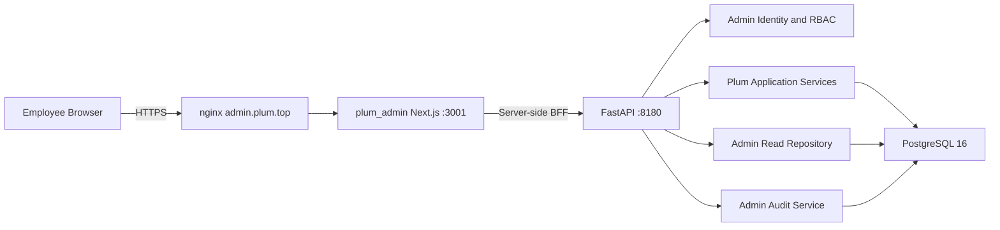

# Plum 管理后台技术设计

- 文档版本：v1.1
- 文档状态：纯只读一期代码已完成；等待生产部署和 UAT 收口
- 更新时间：2026-08-31
- 关联 PRD：[Plum 管理后台产品需求文档](./PRD.md)
- 实施范围：长期技术蓝图；本文明确标注一期实现和后续预留

## 1. 设计摘要

Plum 管理后台采用独立 Next.js 应用，通过服务端 BFF 调用现有 FastAPI 后端。浏览器不持有后端 Admin Token，不直接访问数据库。FastAPI 继续作为业务事实的唯一入口；一期只接入角色、创作者、用户/Membership 和 Overview 的只读链路，官方角色、Subscription、Wallet、治理和独立审核工作台属于后续能力。

方案优先复用现有能力：

- `plum_works`、`plum_character_versions`、`plum_characters` 的内容发布模型。
- Creator Work 草稿、媒体上传、同步审核和幂等发布流程。
- `plum_public_profiles`、角色统计、标签和 Badge 数据。
- `product_memberships`、`subscriptions`、`entitlement_wallets`、`entitlement_ledger`。
- Plum 专属 `plum_admin_users`、共享审计和既有临时明文授权能力。
- 已有 Moderation Admin API。

一期主要后端新增内容是 Admin 聚合查询、员工身份入口和权限依赖。管理后台不建立独立业务数据库。

当前实现已完成 Character/Version/Work/Creator/User Membership 与 Overview 只读模型、筛选绑定的 Keyset Cursor、后端权威 OpenAPI 和对应 Remote UI；BFF 只保留一期 GET 路由及后台成员管理 GET/PATCH。代码已通过 PostgreSQL 聚合测试、契约门禁和桌面/移动端 E2E，等待生产部署和只读 UAT。官方角色和所有业务治理写操作均已移至后续。

### 1.1 一期技术边界

一期实现：

- 飞书 OAuth 后台会话、Plum BFF 服务身份、`/admin/plum/me` 和两角色 Capability。
- 工作台一期指标。
- Character、Version、Work/草稿、Creator、Plum User/Membership 和 Admin User 的 Admin Read API。
- 前后端契约测试、隔离数据库测试和线上只读 UAT。

后续预留但一期不实现：

- Subscription、Wallet、Ledger、支付和财务能力。
- 官方角色媒体、草稿、审核提交、发布 Wrapper 和对应最小审计。
- Character 下架/恢复、Creator Control、内部备注和 Plum Membership 管理。
- 通用审计查询工作台。
- 新建备份基础设施和恢复演练；现有备份、代码回滚记录和发布安全继续执行。
- 独立 Moderation 队列、领取和人工决策 UI/API 整合。
- Tag、Badge、Feed 排序管理。
- 运营活动、导入导出、普通明文入口、通用审批流。

后续条目保留在本文，是为了记录边界和避免错误扩展，不代表一期需要预建路由、表或 UI。

## 2. 当前系统事实

### 2.1 仓库

| 系统 | 本地目录 | GitHub | 技术栈 |
| --- | --- | --- | --- |
| 用户前端 | `/Users/suchong/workspace/ai4all/plum_chat` | `huanshanxiaoyao/plum_chat` | Next.js 16.3、React 19 |
| 后端 | `/Users/suchong/workspace/ai4all/weixin_bot` | `huanshanxiaoyao/ai4all_bridge` | FastAPI、Python 3.11、PostgreSQL 16 |
| 管理后台 | `/Users/suchong/workspace/ai4all/plum_admin` | `huanshanxiaoyao/plum_admin` | Next.js 16.3、React 19、TypeScript 5 |

### 2.2 生产拓扑

Plum 当前部署在 AWS Singapore 独立节点：

```text
Internet
  -> nginx :443
      -> plum_chat Next.js 127.0.0.1:3000
          -> FastAPI 127.0.0.1:8180
              -> PostgreSQL 16 127.0.0.1:55432
```

当前后台生产链路：

```text
admin.plum.top
  -> nginx :443
      -> plum_admin Next.js 127.0.0.1:3001
          -> FastAPI Admin API 127.0.0.1:8180
```

`plum_admin` 与 `plum_chat` 独立构建、独立进程、独立健康检查。后台异常不能成为用户侧服务的依赖。

### 2.3 现有约束

- PostgreSQL 迁移使用全局单链，新增 Plum 迁移也会在其他产品环境执行。
- 当前生产部署在后端应用启动阶段执行待处理迁移；发布前必须完成兼容性、备份和回滚检查，迁移失败时不得停止仍在运行的旧服务。
- 角色和私有资产查询必须遵守 owner 隔离。
- Character Version 是不可变快照，不能原地修改或删除。
- 当前媒体资产以 `owner_platform_user_id` 为强制隔离锚。
- 当前 Admin 身份主要由共享 Bearer Token 映射到静态角色，不适合员工级登录和审计。
- 当前 Subscription 只有 `plan`、`status` 和时间字段，不代表完整支付订阅。

## 3. 设计目标与非目标

### 3.1 设计目标

- 独立部署一个安静、信息密集的内部管理应用。
- 最小化后端改造，同时不绕开业务层和安全边界。
- 后台请求可归因到具体员工。
- 由后端执行 RBAC，不依赖前端按钮可见性。
- 列表查询支持稳定分页、筛选和规模增长。
- 后续写操作实施时必须具备幂等、并发冲突和审计语义。
- 后续官方角色仍应使用现有创作者发布内核。

### 3.2 非目标

- 不建设运营活动或活动投放系统。
- 不建设新的支付服务。
- 不允许管理后台直连数据库。
- 不把用户侧 Cookie 转换为后台权限。
- 不把现有共享 Admin Token 暴露给浏览器。
- 不把所有现有 `/admin/*` API 原样代理到公网后台。
- 不在第一版引入 GraphQL、微服务拆分或独立数据仓库。

### 3.3 前后端集成原则

- `plum_admin` 只通过后端 API 读取或修改业务数据，不直连数据库、不导入 `weixin_bot` 源码，也不依赖 SSH、服务器文件或运维命令完成业务操作。
- 前后端保持独立仓库、独立构建和独立发布，不建设共享运行时代码包。双方只依赖版本化 API 契约，包括资源结构、稳定 ID、状态枚举、Capability、错误、分页、时间、幂等和并发语义。
- 后端 `docs/products/plum/openapi/admin_v1.json` 是 Plum Admin 契约的唯一权威来源；前端只提交快照副本和生成类型，不从后端源码或运行中服务生成。
- 本地开发需要真实联调时，通过服务端 BFF 访问已部署的 HTTPS Admin API，不启动本地 `weixin_bot`。浏览器不得直接访问远端 API。
- 单元测试、CI 和确定性验收 Fixture 不访问线上服务。一期远端业务写请求始终关闭；后续写能力必须重新评审后才能通过配置开启。
- `plum_admin` 与 FastAPI 部署在同一线上节点时，可以通过 loopback 或私网地址调用后端 API；这仍是 API 边界，并可避免不必要的公网回环。
- 后端是员工状态、RBAC 和所有业务规则的最终裁决方。前端 Session、导航和按钮可见性不构成授权依据。

## 4. 总体架构



### 4.1 plum_admin 职责

- 员工登录和后台会话。
- 页面路由、交互和表单状态。
- 服务端 BFF，隐藏后端服务凭据。
- 将后端错误映射为一致的 UI 状态。
- 权限相关的界面裁剪，但不作为最终授权边界。

### 4.2 FastAPI 职责

- 验证 BFF 服务身份和员工身份。
- 读写产品私有 `plum_admin_users` 并执行 RBAC。
- 提供 Plum 范围的 Admin 聚合 API。
- 调用现有领域服务完成发布、审核和状态迁移。
- 执行服务端分页、筛选、脱敏和审计。
- 固定 `app_id=plum`，不接受客户端覆盖产品范围。

### 4.3 PostgreSQL 职责

- 保持现有业务事实源。
- 保存后台成员、创作者控制和审计记录。
- 不保存后台 Web Session；首版由 Next.js 加密 Cookie 或服务端 Session Store 管理。

## 5. 前端技术设计

### 5.1 技术选型

- Next.js 16，与 `plum_chat` 对齐。
- React 19、TypeScript 5。
- App Router。
- Server Components 用于首屏查询，Client Components 用于表格交互和表单。
- 图标使用 Lucide。
- 表单校验使用共享 TypeScript Schema；具体 Schema 库在工程初始化时根据依赖策略决定。
- 首版不引入复杂全局状态库，URL 保存筛选状态，局部状态由 React 管理。

### 5.2 当前目录与演进边界

```text
app/
  (admin)/
    layout.tsx
    page.tsx
    characters/page.tsx
    creators/page.tsx
    users/page.tsx
    subscriptions/page.tsx
    audit/page.tsx
    staff/page.tsx
  login/
  access-denied/
  api/
    auth/
    admin/[...path]/route.ts
contracts/
  plum-admin-v1.openapi.json
  generated/admin-api.ts
features/
  admin-navigation/
    modules.ts
  admin-resources/
    contracts.ts
    data-source.ts
    fixtures.ts
  admin-sections/
    admin-section-page.tsx
    definition.ts
    presentation.tsx
  admin-shell/
  dashboard/
  characters/
  creators/
  users/
  subscriptions/
  audit/
  staff/
lib/
  auth/
  bff/
  server/
```

这是 PR-C 后的组织方式，应用依赖方向固定为 `app -> features -> lib`，`contracts` 是不依赖应用代码的叶子层：

- `app` 只声明 URL、Layout 和 Route Handler。六个后台业务模块使用显式路由，删除宽泛的 `[section]` 业务 catch-all，未知一级路径由 Next.js 直接返回 404。
- `features/admin-navigation/modules.ts` 是模块可用性、导航和 Capability 要求的唯一前端注册表；环境判断保留在 Server Component，浏览器组件只接收已经裁剪的导航数据。
- `features/admin-sections` 统一处理鉴权、查询参数、分页、错误和空态；各业务目录只拥有自己的页面定义、列配置与行映射，避免再次形成跨领域巨型页面。
- `contracts` 保存后端 OpenAPI 的逐字节副本和 `openapi-typescript` 生成结果；生成文件禁止手改，漂移检查进入 `npm run verify`。
- `features/admin-resources` 保存未交付模块的本地 Fixture、数据源和运行时 Guard；M1 Staff 类型直接引用生成 Schema，后续资源随 M2 契约逐项替换手写类型。
- `lib` 只保存 Auth、BFF 和服务端基础设施，不允许反向依赖 `features` 或 `app`；架构测试固化该规则。

前端可以在非生产 Fixture 模式保留 `subscriptions` 和 `audit` 原型页，用于未来范围的并行设计。生产 Remote 模式只显示后端真实 API 已交付的模块：当前为工作台基础壳、`characters`/`works`/`creators`/`users`，以及仅 Admin 可见的 `staff`；未交付模块不显示导航，直接访问返回 404。`subscriptions`、`audit`、`moderation`、`taxonomy` 仅表示长期目录方向，一期不创建 Remote 导航或空接口。

### 5.3 BFF 规则

- 浏览器只调用 `plum_admin` 同源 `/api/admin/*`。
- BFF 将请求转换为后端 `/admin/plum/*`。
- 只允许显式注册的路径和 HTTP 方法，不提供任意路径透传代理。
- BFF 自动附加服务凭据、员工 ID 和 Request ID。
- BFF 不记录请求 Cookie、Authorization、角色私有正文或上传文件正文。
- SSE 不是后台 MVP 的需求；长任务使用异步任务状态轮询。

### 5.4 UI 状态

每个页面必须区分：

- Initial loading。
- Refreshing。
- Empty result。
- Forbidden。
- Validation error。
- Conflict。
- Backend unavailable。

筛选和分页状态写入 URL Query。分页默认使用游标，不使用高 Offset。

## 6. 员工身份与权限

### 6.1 登录链路

一期使用飞书 OAuth 授权码流程；认证模块保留 Provider Adapter 边界，未来替换身份提供方不改变后端 Admin Identity 契约：

1. 员工访问 `admin.plum.top`。
2. `GET /api/auth/feishu/start` 生成随机 `state`、PKCE verifier/challenge；签名交易写入 10 分钟、HttpOnly、SameSite=Lax Cookie。
3. 浏览器跳转 `https://accounts.feishu.cn/open-apis/authen/v1/authorize`，不主动请求普通 OpenAPI Scope 或 `offline_access`。
4. `GET /api/auth/feishu/callback` 校验 state、Cookie 签名和过期时间，携带 PKCE verifier 以 JSON 调用 `POST https://open.feishu.cn/open-apis/authen/v2/oauth/token`。
5. Next.js 用短期 access token 调用 `GET /open-apis/authen/v1/user_info`，提取同一飞书应用下的 `open_id`、`union_id`、`tenant_key`、姓名、可选头像和邮箱。
6. Callback 调用后端 `POST /admin/plum/session`；后端以 `open_id` 原子 Upsert `plum_admin_users`，首次登录默认创建 Active Operator，重复登录更新资料和 `last_login_at`。
7. 后端校验员工状态、角色和 Capability 后，Next.js 建立 8 小时 Secure、HttpOnly、SameSite=Strict 后台会话；回调结束即丢弃飞书 Token，不保存 access/refresh token。
8. 后续页面和 BFF 请求仍调用只读 `/admin/plum/me` 获取最新状态；Disabled 成员即使持有未过期 Cookie 也会立即被拒绝。

飞书应用“可用范围”是外部准入边界，仅配置产品、运营和管理人员。禁止根据邮箱域名自动授权，也不调用通讯录导出接口。Admin 不通过自注册产生：首个 Admin 使用一次性 Bootstrap 建立，后续只能由 Active Admin 授予。

飞书 OAuth token 与 `user_info` 不要求普通 OpenAPI 权限。本流程不使用 `auth:user_access_token:read`；该权限不是 `auth:user.id:read` 的替代项，也不是本登录链路的前置依赖。

后端同时服务三个业务，Plum Admin 必须保持产品级隔离。现有 `app/products/zhaoxi/api/admin_accounts.py` 的旧 `/admin/me` 保持路径、Token 和响应契约不变；Plum 新身份固定使用 `/admin/plum/me`，由 `app/products/plum/manifest.py` 注册。组合根只负责调用 Plum Admin Router Installer，不让 Plum Admin Identity 导入其他产品实现。Route Inventory 测试必须证明两个端点各注册一次。

### 6.2 BFF 到后端身份

新增 Plum 独立的 `PLUM_ADMIN_BFF_TOKEN`，仅存在于 `plum_admin` 和 FastAPI 的服务端环境：

```http
Authorization: Bearer <PLUM_ADMIN_BFF_TOKEN>
X-Admin-User-Id: <feishu-open-id>
X-Admin-Email: <normalized-email-or-empty-string>
X-Request-Id: <uuid>
```

后端只信任 Bearer Token 证明的 BFF；员工角色和状态必须从后端 `plum_admin_users` 读取，不信任前端传入的 Role Header。`POST /admin/plum/session` 还必须接收并校验 `open_id`、`tenant_key` 等 Provider Identity 字段，且仅供 OAuth callback 使用。

现有 `ADMIN_TOKEN`、`ADMIN_STAFF_TOKEN` 和 Reviewer Token 保留给既有控制台兼容使用，但不得进入 `plum_admin` 浏览器或客户端 Bundle。

### 6.3 权限模型

使用代码内稳定 Capability，不在路由里散落角色判断。当前身份契约保留四个稳定能力键，其中瘦身一期业务仅使用 `operations.access` 和 `staff.manage`；另外两个为后续治理能力预留：

```text
operations.access
character.restore
membership.manage
staff.manage
```

角色到 Capability 的映射版本化保存在代码中。新后台身份层只接受 `plum_admin_users.role` 为 `operator` 或 `admin` 的成员；未知角色不会获得权限。第一版不新增多角色关联表。Operator 获得 `operations.access`，Admin 额外获得 `staff.manage`；已有响应中的治理 Capability 不代表一期开放对应路由或 UI。

| Capability | Operator | Admin |
| --- | --- | --- |
| `operations.access` | 是 | 是 |
| `character.restore` | 否 | 是 |
| `membership.manage` | 否 | 是 |
| `staff.manage` | 否 | 是 |

`admin` 并不隐含普通明文访问权限。手机号、邮箱、Prompt、聊天、Persona 和记忆正文仍受脱敏或既有临时审批约束，一期后台不提供普通明文入口。

一期不新增审批单、审批状态或通知表。Operator 对 `staff.manage` 的请求直接返回 403；Admin 必须使用自己的会话执行成员管理。Character、Creator 和 Membership 治理路由不进入一期 BFF Allowlist，不能仅凭 Capability 打开。

## 7. 后端模块设计

### 7.1 建议代码位置

```text
app/products/plum/api/admin/
  router.py
  identity.py
  overview.py
  characters.py
  creators.py
  users.py
  subscriptions.py  # 后续
  audit.py          # 后续通用查询
  staff.py
  official.py
  contracts.py
app/products/plum/application/admin/
  authorization.py
  official_character.py
  character_governance.py   # 后续
  creator_governance.py     # 后续
  membership_governance.py  # 后续
  staff_management.py
app/products/plum/infrastructure/
  admin_repository.py
  creator_control_repository.py  # 后续
```

`taxonomy.py`、独立 Moderation Admin Adapter 和 Wallet/Ledger Repository 留待后续。现有 `app/routers/admin_plum.py` 可继续承载评测、记忆、诊断、模型和发布配置，但不作为一期新后台的任意代理入口。新的日常运营 API 独立成包，并由同一应用组合根挂载，避免单文件继续膨胀。

### 7.2 Admin Read Repository

后台列表通常跨越多个领域表，不应让前端逐条调用用户侧 API。新增只读 Repository 提供批量 Join 和聚合投影：

- 角色列表一次查询返回 Work、Creator Profile、当前 Version、Stats 和状态摘要。
- 创作者列表按页聚合作品数量和统计，不做 N+1 查询。
- 用户列表固定 Join `product_memberships.app_id='plum'`。
- Subscription、Wallet 和 Ledger 查询全部留待后续。
- 所有列表使用 Keyset Cursor，限制最大 Page Size。

Repository 只返回 Admin Read Model，不将整行数据库对象直接序列化给客户端。

### 7.3 官方角色身份策略

**交付阶段：后续。** 本节仅保留候选设计，不构成一期配置、实现或验收要求。

现有媒体资产强制以 `owner_platform_user_id` 隔离，而 `plum_works` 又支持 `system` Work。为了最小化共享媒体模型改造，后续可采用一个经过验证的 Plum 官方创作者账号：

- 后端配置 `PLUM_OFFICIAL_CREATOR_PLATFORM_USER_ID`。
- 该用户拥有 Active Plum Membership 和固定 Public Profile，例如 `Plum Official`。
- Admin 官方角色上传和草稿接口在服务端使用该 owner 调用现有媒体和 Creation 服务。
- 浏览器不能提交或覆盖 owner ID。
- 所有员工操作仍记录真实 Admin User，而不是把官方创作者账号当作员工身份。

该方案复用媒体 owner、草稿、审核和发布不变量。正式实施前仍需重新确认 Owner、表单、媒体限制和审核口径；若未来要求官方内容无真人权利主体，再单独设计系统媒体所有权迁移。

### 7.4 创作者控制

平台 Membership 禁用会阻断整个 Plum 产品，不能用于“只禁止创作”。新增产品私有控制表：

```sql
CREATE TABLE plum_creator_controls (
    platform_user_id TEXT PRIMARY KEY,
    status TEXT NOT NULL CHECK (status IN ('active', 'restricted')),
    reason TEXT,
    internal_note TEXT,
    updated_by_admin_user_id TEXT NOT NULL,
    restricted_at TEXT,
    updated_at TEXT NOT NULL
);
```

创建草稿、上传创作者媒体和发布 Work 的入口统一调用 `require_creator_active`。读取 Feed、聊天和普通用户功能不读取该控制表。

每次状态变化同时写入 `admin_access_events`；当前状态保存在控制表，历史保存在不可变审计事件中。

## 8. API 设计

### 8.1 通用约定

- Base Path：`/admin/plum`。
- 响应 JSON 使用 `snake_case`，与现有后端一致。
- 每个响应返回 `X-Request-Id`；客户端传入合法 UUID 时沿用，否则服务端生成 UUIDv4。
- 写接口接受 `reason`；高风险操作必填。
- 创建和发布接受 `Idempotency-Key`。
- 修改当前状态时接受 `expected_version` 或 `If-Match`，防止覆盖并发修改。
- 不返回 FastAPI 默认的自由形态 `detail`；`/admin/plum/*` 由统一异常处理器转换为下述契约。

#### 8.1.1 成功响应

单资源响应：

```json
{
  "data": {
    "id": "char_accept_official_active"
  },
  "meta": {
    "request_id": "c255a9ba-779a-4c6c-9f99-dfc9de6385b6"
  }
}
```

无响应体的成功写操作仍返回 `200` 和当前资源投影，不使用空 `204`，便于前端立即刷新乐观状态。资源创建返回 `201`。

#### 8.1.2 错误响应

```json
{
  "error": {
    "code": "character_state_conflict",
    "message": "Character state changed. Refresh and try again.",
    "request_id": "c255a9ba-779a-4c6c-9f99-dfc9de6385b6",
    "details": {
      "current_status": "takedown"
    }
  }
}
```

`code` 是稳定、可测试的机器码；前端优先按 `code` 映射文案，`message` 只作安全的回退显示。`details` 只能包含白名单字段，不能透传异常堆栈、SQL、Token、Prompt 或用户正文。

| HTTP | 典型 Code | 语义 |
| --- | --- | --- |
| 400 | `invalid_argument`、`invalid_cursor`、`invalid_time_range` | 请求语法或查询条件错误 |
| 401 | `admin_unauthenticated` | BFF 或员工会话无效 |
| 403 | `admin_permission_denied`、`admin_user_disabled`、`creator_restricted` | 已认证但无权执行，或创作者资格受限 |
| 404 | `resource_not_found` | 资源不存在或不应向调用者暴露 |
| 409 | `revision_conflict`、`character_state_conflict`、`idempotency_conflict` | 并发或状态冲突 |
| 413 | `media_too_large` | 上传超过限制 |
| 415 | `media_type_unsupported` | 媒体格式不支持 |
| 422 | `validation_failed` | 字段语义校验失败；`details.fields` 返回字段错误 |
| 429 | `rate_limited` | 超出限流；同时返回 `Retry-After` |
| 500 | `internal_error` | 未分类服务端错误 |
| 502/503 | `dependency_unavailable` | 审核、存储或其他依赖不可用 |
| 504 | `upstream_timeout` | 上游超时 |

上表同时约束 M1 和后续 Admin API。PR-C 已将 M1 身份/成员接口的权限拒绝统一为 `admin_permission_denied`，字段及语义校验统一为 `validation_failed`；FastAPI 字段错误不会回显提交值，并通过 `details.fields` 返回字段位置、消息和类型。

#### 8.1.2.1 OpenAPI 版本与漂移门禁

- 后端显式导出 `docs/products/plum/openapi/admin_v1.json`，当前包含身份/成员接口，以及 Character、Version、Work、Creator 和 User/Membership 只读接口。
- `/admin/plum/*` 下的评测、记忆和模型配置等历史控制面不属于新后台契约；导出器使用显式路径集合，不能按前缀整体收录。
- 前端 vendoring 同一 JSON 并生成 TypeScript 类型。Identity、Capability、Staff 和分页结构引用生成 Schema，远端 JSON 仍必须经过运行时 Guard。
- 后端 PR 先更新响应模型、聚焦契约测试和快照；前端 PR 再同步 JSON、重新生成并通过 `contract:check`。新增 M2 路径必须显式加入导出集合，避免偶然扩大 BFF 表面。

#### 8.1.3 分页契约

列表请求统一支持：

```text
limit=50
cursor=<opaque-token>
q=<trimmed-search-text>
sort=created_at.desc
```

- `limit` 默认 50，最小 1，最大 200；越界返回 `400 invalid_argument`，不静默截断。
- `cursor` 是服务端生成的 Base64URL 不透明 Token，v1 内部绑定资源类型、排序、筛选摘要、最后排序键和资源 ID。
- 客户端不得解析或拼接 Cursor。Cursor 与不同筛选或排序组合复用时返回 `400 invalid_cursor`。
- 查询使用 Keyset Pagination，排序字段后固定追加唯一 ID 作为 Tie-breaker。
- 默认不返回精确 `total_count`；工作台等确需总量的接口使用独立聚合查询。

列表响应：

```json
{
  "data": [
    {"id": "char_accept_official_active"},
    {"id": "char_accept_ugc_general"}
  ],
  "page": {
    "limit": 2,
    "next_cursor": "eyJ2IjoxLC4uLn0",
    "has_more": true
  },
  "meta": {
    "request_id": "c255a9ba-779a-4c6c-9f99-dfc9de6385b6"
  }
}
```

最后一页返回 `next_cursor: null` 和 `has_more: false`。空列表仍返回 `data: []`，不是 404。

#### 8.1.4 时间契约

- 所有时间点响应统一使用 UTC RFC 3339，例如 `2026-08-28T03:15:42.123Z`。
- 请求中的 `from`、`to` 接受 RFC 3339 且必须带 `Z` 或显式 Offset；后端转换为 UTC。
- 时间区间统一使用半开区间 `[from, to)`，`to` 不包含在结果内。
- 日报类接口额外接受 IANA `timezone`，一期默认 `Asia/Shanghai`，并在 `meta.timezone` 回显。
- 仅日期输入使用 `YYYY-MM-DD`，必须与 `timezone` 一起出现；禁止依赖服务器本地时区推断。
- 数据库历史无 Offset 时间按现有业务约定解释为 `Asia/Shanghai`，在 Admin Repository 边界转换为 UTC。
- 时长字段使用整数毫秒并以 `_ms` 结尾，不使用格式化字符串。

### 8.2 身份与工作台

**交付阶段：一期。** 工作台只聚合一期只读资源，不返回 Official 操作、Moderation、Wallet、Tag、Badge 或审计指标。

| Method | Path | Capability | 说明 |
| --- | --- | --- | --- |
| POST | `/admin/plum/session` | Valid BFF + Feishu identity | 首次登录自注册或更新登录资料，并返回权威身份 |
| GET | `/admin/plum/me` | Active member | 当前 Plum 后台员工、角色和 Capability |
| GET | `/admin/plum/overview` | `operations.access` | 工作台指标和最近更新摘要 |

### 8.3 角色

**交付阶段：一期只读。** 官方角色和其他业务写接口属于后续。

| Method | Path | Capability | 说明 |
| --- | --- | --- | --- |
| GET | `/admin/plum/characters` | `operations.access` | 角色分页列表 |
| GET | `/admin/plum/characters/{id}` | `operations.access` | 角色详情和版本摘要 |
| GET | `/admin/plum/characters/{id}/versions` | `operations.access` | 不可变版本列表 |
| GET | `/admin/plum/works` | `operations.access` | Work、草稿和审核状态分页列表 |
| GET | `/admin/plum/works/{id}` | `operations.access` | Work 和草稿详情 |

后续候选接口包括 `/admin/plum/official/*`、`takedown` 和 `restore`。它们不进入一期 API 清单、生产导航或可用能力承诺；一期收口前删除 BFF Allowlist 中已有的预留路径，正式实施时重新完成契约和安全评审。

### 8.4 创作者

**交付阶段：一期只读。**

| Method | Path | Capability | 说明 |
| --- | --- | --- | --- |
| GET | `/admin/plum/creators` | `operations.access` | 创作者分页列表 |
| GET | `/admin/plum/creators/{id}` | `operations.access` | 创作者、作品和表现摘要 |

`id` 使用 `platform_user_id`，不使用可变 Handle。跨产品用户不存在或不具有 Plum 创作资产时返回 404。Creator Control 和内部备注为后续治理接口。

### 8.5 用户与 Membership

**交付阶段：用户和 Membership 只读为一期；所有写操作、Subscription、Wallet 和 Ledger 为后续。**

| Method | Path | Capability | 说明 |
| --- | --- | --- | --- |
| GET | `/admin/plum/users` | `operations.access` | Plum 用户分页列表 |
| GET | `/admin/plum/users/{id}` | `operations.access` | 用户详情摘要 |

以下接口保留为后续方向，不能加入一期 Router、BFF Allowlist 或导航：

| Method | Path | Capability | 说明 |
| --- | --- | --- | --- |
| POST | `/admin/plum/users/{id}/membership/disable` | `membership.manage` | 禁用 Plum Membership |
| POST | `/admin/plum/users/{id}/membership/enable` | `membership.manage` | 恢复 Plum Membership |
| GET | `/admin/plum/subscriptions` | `operations.access` | 订阅分页列表 |
| GET | `/admin/plum/users/{id}/wallet` | `operations.access` | 钱包摘要 |
| GET | `/admin/plum/users/{id}/wallet/ledger` | `operations.access` | 钱包流水分页 |

后续若接入 Subscription，响应必须显式返回 `billing_connected: false`，直到真实支付系统上线，避免前端将 Free Plan 记录描述为支付成功。

### 8.6 标签、Badge、审核和审计

**交付阶段：本节接口均为后续。** 一期不交付官方角色写链路、业务写审计或通用审计查询路由和页面。

| Method | Path | Capability | 说明 |
| --- | --- | --- | --- |
| GET | `/admin/plum/tags` | `operations.access` | 标签列表 |
| POST/PATCH | `/admin/plum/tags...` | `operations.access` | 创建和更新标签 |
| GET | `/admin/plum/badges` | `operations.access` | Badge 列表 |
| PUT/DELETE | `/admin/plum/characters/{id}/badges/{badge_id}` | `operations.access` | 分配或移除 Badge |
| PATCH | `/admin/plum/characters/{id}/feed-order` | `operations.access` | 基础 Feed 排序 |
| GET/POST | `/admin/moderation/tasks...` | `operations.access` | 复用现有审核队列和决策 API |
| GET | `/admin/plum/audit-events` | `operations.access` | 操作审计分页查询 |

### 8.7 后台成员

**交付阶段：一期。**

| Method | Path | Capability | 说明 |
| --- | --- | --- | --- |
| GET | `/admin/plum/admin-users` | `staff.manage` | 后台成员分页列表，可按姓名、`open_id` 和状态筛选 |
| PATCH | `/admin/plum/admin-users/{open_id}` | `staff.manage` | 修改角色或启停状态；禁止禁用或降级最后一个 Active Admin |

`plum_admin_users` 是 Plum 产品私有员工目录，不复用普通业务用户 `platform_users`，也不写入三个业务共享的 `admin_users`。一期直接以应用维度唯一的 `open_id` 为主键，并保存可空 `union_id`、`tenant_key`、姓名、可选邮箱和头像、`role`、`status`、`created_at`、`last_login_at` 和 `updated_at`。

## 9. 状态与并发

### 9.1 Character 治理状态

**交付阶段：后续。**

第一版不新增平行的 Character 状态机。应用服务将管理动作映射到现有 Character 和 Work 状态，并验证：

- 下架只允许从可分发状态进入不可分发状态。
- 重复下架返回相同结果或明确的 No-op，不重复产生业务副作用。
- 恢复前重新检查当前 Version、Moderation、Media、Visibility 和 Work Lifecycle。
- 恢复失败不部分更新任何投影。

如果现有状态无法区分“创作者归档”和“平台下架”，应增加明确的治理字段或事件，而不是复用一个含义模糊的 `archived`。

### 9.2 乐观并发

- Work 草稿沿用 Revision 乐观锁。
- Character 管理操作携带当前 `content_version` 和状态。
- 更新失败返回 409，前端要求刷新后重新确认。
- 发布使用现有 Idempotency Key，网络重试不产生第二个 Character Version。

## 10. 审计设计

**交付阶段：后续。** 一期仅沿用已交付的员工身份和后台成员管理审计，不新增官方角色或治理写操作审计能力。

复用 `admin_access_events`，所有写操作和敏感读取统一通过一个 Audit Helper 写入：

```json
{
  "action": "plum.character.takedown",
  "resource_type": "plum_character",
  "resource_id": "char_...",
  "reason": "policy_violation",
  "metadata": {
    "request_id": "req_...",
    "result": "success",
    "before": {"status": "active"},
    "after": {"status": "takedown"}
  }
}
```

审计要求：

- 审计失败时，高风险写操作应失败关闭，避免“修改成功但无记录”。
- 审计和业务修改尽量位于同一数据库事务。
- 对外部审核调用等跨事务动作，记录 Attempt 和 Final Result 两个事件。
- `metadata_json` 只放受控字段，不接受客户端任意 JSON 原样写入。
- 任何 Token、Cookie、Prompt 和聊天正文禁止进入审计。

## 11. 隐私与脱敏

### 11.1 默认字段策略

| 数据 | Operator | Admin |
| --- | --- | --- |
| 平台用户 ID | 可见 | 可见 |
| 手机号/邮箱 | 脱敏 | 脱敏 |
| 对话正文 | 不可见 | 不可见；需另走明文审批 |
| Character Prompt | 默认不可见 | 默认不可见；需另走明文审批 |
| Wallet balance/ledger | 一期不返回 | 一期不返回 |
| Provider Token/密钥 | 不可见 | 不可见 |

### 11.2 明文访问

现有 `admin_plaintext_grants` 已支持申请人、审批人、账号范围、资源范围和过期时间。新后台如果未来提供明文入口，必须调用这一机制，不另设“管理员总是可见”的旁路。

## 12. 部署设计

### 12.1 目录与进程

生产目录：

```text
/opt/workspace/plum_admin
```

新增用户级 systemd 单元：

```text
plum-admin-frontend.service
```

建议配置：

- `WorkingDirectory=/opt/workspace/plum_admin`
- `npm run start -- -H 127.0.0.1 -p 3001`
- `Restart=always`
- 日志写入 `/var/log/apps/plum-admin-frontend.{out,err}.log`
- 环境文件权限仅允许运行用户读取。

### 12.2 nginx

- 独立域名 `admin.plum.top`。
- 独立 TLS 证书和访问日志。
- 只反代到 `127.0.0.1:3001`。
- 不提供到 `/admin/*` 后端的任意公网直通 Location。
- 上传大小与现有角色媒体限制一致。
- 增加 HSTS、CSP、`X-Content-Type-Options`、`Referrer-Policy` 和受限 `Permissions-Policy`。
- Basic Auth 可以作为上线初期的额外防线，但不能替代员工登录和后端 RBAC。

### 12.3 配置

`plum_admin` 至少需要：

```text
ADMIN_API_ORIGIN=http://127.0.0.1:8180
ADMIN_DATA_SOURCE=remote
PLUM_ADMIN_BFF_TOKEN=...
ADMIN_API_WRITE_ENABLED=false
ADMIN_SESSION_SECRET=...
ADMIN_AUTH_MODE=feishu
FEISHU_CLIENT_ID=...
FEISHU_CLIENT_SECRET=...
FEISHU_REDIRECT_URI=https://admin.plum.top/api/auth/feishu/callback
```

FastAPI 增加：

```text
PLUM_ADMIN_BFF_TOKEN=...
PLUM_OFFICIAL_CREATOR_PLATFORM_USER_ID=...
PLUM_ADMIN_WRITES_ENABLED=false
```

所有服务端密钥必须使用独立随机值，不能复用 `ADMIN_TOKEN`、用户 Session Secret 或 Reviewer Token。

### 12.4 发布顺序

1. 保持前后端写开关关闭，部署向后兼容的后端代码。
2. 在重启前确认待执行迁移向后兼容，并记录可用的代码回滚基线；一期不以新建备份设施或恢复演练为发布门槛。
3. 启动新后端实例，由应用启动流程执行迁移；迁移或启动失败时保留旧服务运行。
4. 验证 FastAPI readiness、Admin API 鉴权和只读接口。
5. 构建 `plum_admin`。
6. 启动或重启 `plum-admin-frontend`。
7. 验证本机 `127.0.0.1:3001`。
8. 安装 nginx 配置并执行 `nginx -t`。
9. Reload nginx。
10. 完成登录、只读查询、403 和跨产品隔离 UAT。
11. 确认前后端业务写开关均保持关闭，Official、治理和其他后续接口未作为一期生产能力开放。

数据库迁移失败时不得停止仍在运行的旧服务。

## 13. 可观测性

- 后台 Next.js 提供 `/api/health`，不依赖业务查询即可返回进程健康。
- FastAPI Admin API 记录 Request ID、员工 ID、路由、状态码和耗时，不记录敏感 Body。
- 监控登录失败率、401/403、5xx 和查询延迟。
- 工作台聚合查询设置独立超时，避免慢查询拖垮用户侧连接池。
- 对 Admin API 设置独立限流键；后续上传和导出能力需另设更低限额。
- 将 `plum_admin` 加入 aws-sg 健康检查和日志轮转。

## 14. 测试策略

### 14.1 前端

- Capability 到导航和按钮的映射测试。
- BFF Allowlist 对一期外业务写路径保持关闭的测试。
- 表格筛选、URL 恢复、分页和空态测试。
- 登录过期、403 和后端不可用测试。
- 桌面和窄屏关键页面的 Playwright 截图测试。

### 14.2 后端

一期后端测试不得依赖开发机现有数据库内容。`tests/conftest.py` 清除环境中的 `DATABASE_URL`，使用 `pytest-postgresql` 对完整 Migration 模板进行每测试克隆；一期新增的验收 Seed Helper 只能向该临时数据库写入合成数据，禁止作为生产启动 Seed 或调用线上接口准备 Fixture。

- 每个 Capability 的允许和拒绝矩阵。
- BFF Token 无效、员工不存在、员工禁用的鉴权测试。
- 所有用户查询固定 Plum Membership 的跨产品隔离测试。
- 角色列表分页稳定性和无 N+1 查询测试。
- Overview 聚合口径、时间边界和空数据测试。

### 14.3 生产冒烟

一期生产冒烟只验证身份、RBAC 和只读能力，不执行任何业务写请求，也不修改真实用户、创作者、Work 或 Character。

- 未登录访问跳转登录。
- 非成员登录后显示无权限。
- Operator 能查看 Character、Work、Creator、User 和 Overview，但不能管理后台成员。
- Operator 管理后台成员时返回 403；Admin 可以管理后台成员。
- Official、Character、Creator 和 Membership 业务写接口不可作为一期生产能力访问。
- 后台停止后 `https://plum.top` 仍正常。

## 15. 安全风险与控制

| 风险 | 控制 |
| --- | --- |
| BFF Token 泄露 | 仅服务端保存、文件最小权限、独立轮换、后端审计 |
| 前端伪造角色 | 后端从 Plum 私有 `plum_admin_users` 读取角色，不信任 Role Header |
| 共享 Token 无法归因 | 新后台使用员工身份；共享 Token 仅兼容旧控制台 |
| 管理 API 被任意代理 | BFF 路径 allowlist；nginx 不直通整个 `/admin` |
| 跨产品用户泄露 | 后端固定 `app_id=plum`，加入隔离契约测试 |
| 批量查询拖垮生产 | Keyset 分页、最大 Limit、索引、查询超时 |
| 后续官方角色重复发布 | 正式实施时使用 Idempotency-Key、Revision 乐观锁、最小审计和双写开关 |
| 同机故障影响后台和主站 | 进程隔离；后台不是用户侧依赖；沿用既有备份和代码回滚流程 |

## 16. 数据库迁移评估

一期身份和只读 API 原则上不需要新的 Plum 业务表；只有查询计划证明必要时才补组合索引。

一期仅在查询计划证明必要时增加支撑后台列表的组合索引，不新增治理状态表或字段。

不新增：

- 独立后台业务数据库。
- 运营活动表。
- 订阅支付表，直到支付业务设计明确。
- 一期审计表；后续写能力优先复用 `admin_access_events`。
- Wallet 或 Ledger 相关表和字段。

所有迁移必须幂等、兼容旧 Writer，并通过全局迁移链的多产品测试。

## 17. 实施拆分

一期按以下技术里程碑交付，任务、依赖、验收和回滚门槛以 [一期详细开发计划](./DEVELOPMENT_PLAN.md) 为准：

1. 契约与测试基线。
2. Admin Identity、RBAC 和后台成员基础。
3. 一期只读 Admin API 与前端真实数据接入。
4. 精简 Overview。
5. 线上只读 UAT、主站与多产品回归、文档收口。

以下技术能力留待后续单独设计和排期：

- Wallet/Ledger、支付或财务能力。
- Subscription 查询和管理。
- 官方角色创建、媒体上传、审核提交、发布 Wrapper 和对应最小审计。
- Character、Creator、Membership 治理和通用审计查询工作台。
- 新建备份基础设施和恢复演练。
- 独立 Moderation 管理工作台。
- Tag、Badge 和 Feed 排序。
- JSON 导入、校验预览和异步任务。
- 更细 Capability、多角色、受控导出和双人审批。

## 18. 一期已确认决策

1. 使用飞书 OAuth 2.0 登录，认证模块保留 Provider Adapter。
2. 使用 `admin.plum.top` 作为生产后台域名。
3. 官方角色整体移至后续；一期不要求配置 `Plum Official` Owner、表单或媒体规则。
4. Character、Creator 和 Membership 治理属于后续，一期不开放。
5. 后续若实施官方角色，第一版优先表单录入，批量导入另行评审。
6. 创作者限制和内部备注属于后续治理能力。
7. 一期无官方角色专项模块和写流程、运营活动、Subscription、Wallet/Ledger、业务治理写操作、独立审核工作台、Tag/Badge/Feed 管理、普通明文访问、备份基础设施或恢复演练里程碑；已有 `official` 来源内容仅作为通用只读数据展示。
8. API 错误、分页和时间契约以本文 8.1 为权威定义。
9. 验收数据和场景以 [验收样例](./ACCEPTANCE_SAMPLES.md) 为权威输入；一期只执行被标记为一期范围的样例。
10. 一期新后台 RBAC 只包含 Operator 和 Admin；旧控制台 Reviewer Token 仅作兼容，不映射为新后台角色。
